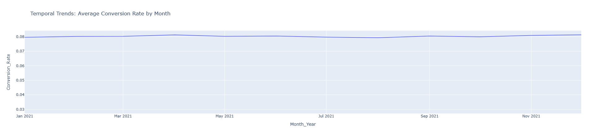

# Marketing Campaign Dashboard

This is an interactive dashboard built using Python, Plotly Dash, and Pandas.

## Project Overview
The dashboard analyzes marketing campaign performance, audience segmentation, channel effectiveness, geographical insights, and more.

## Files
- `app.py` : Main Dash app file
- `marketing_campaign_dataset.csv` : Dataset used
- `requirements.txt` : Python package dependencies

## Running Locally
1. Clone this repository
2. Install dependencies:
3. Download Dataset: https://www.kaggle.com/datasets/manishabhatt22/marketing-campaign-performance-dataset 
4. Run the app:
5. Visit [http://127.0.0.1:8050](http://127.0.0.1:8050) to view the dashboard

---

